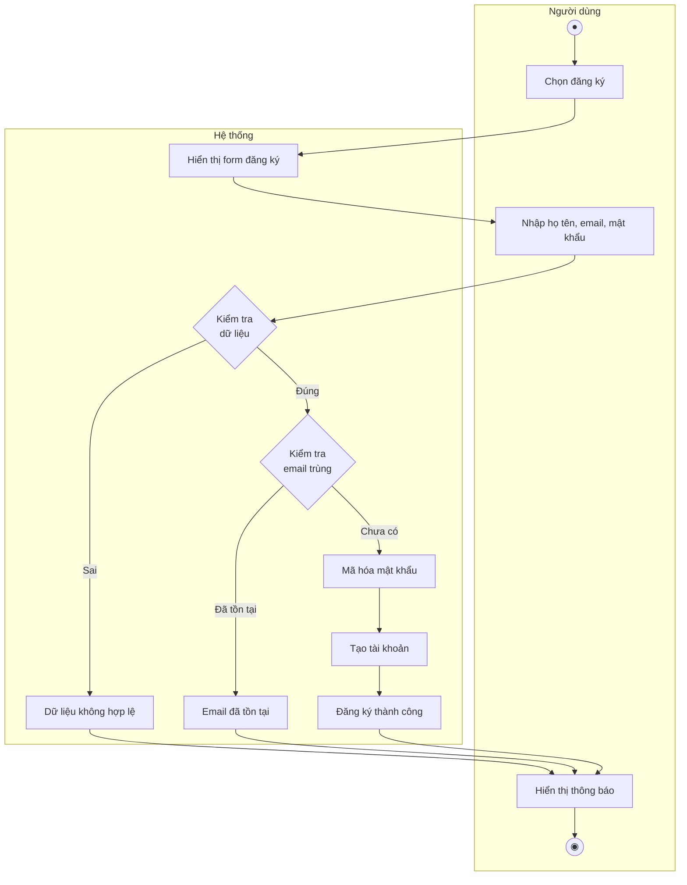
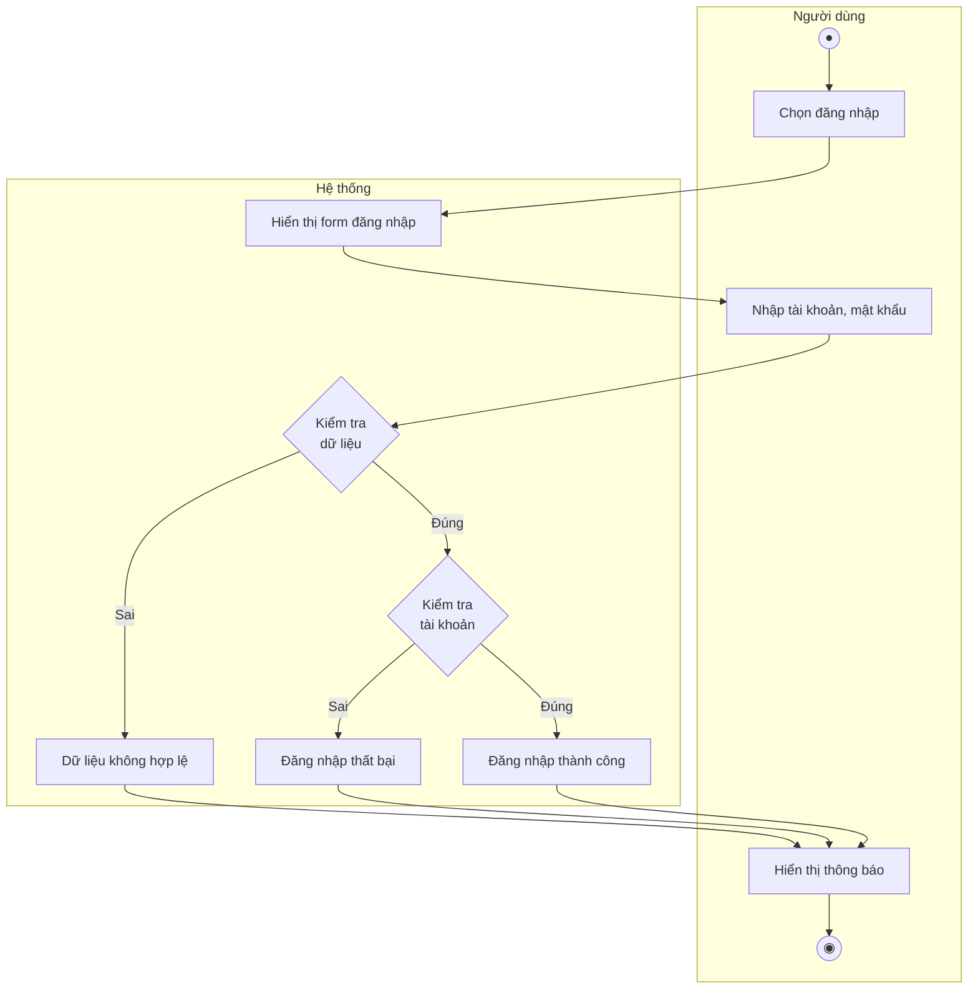
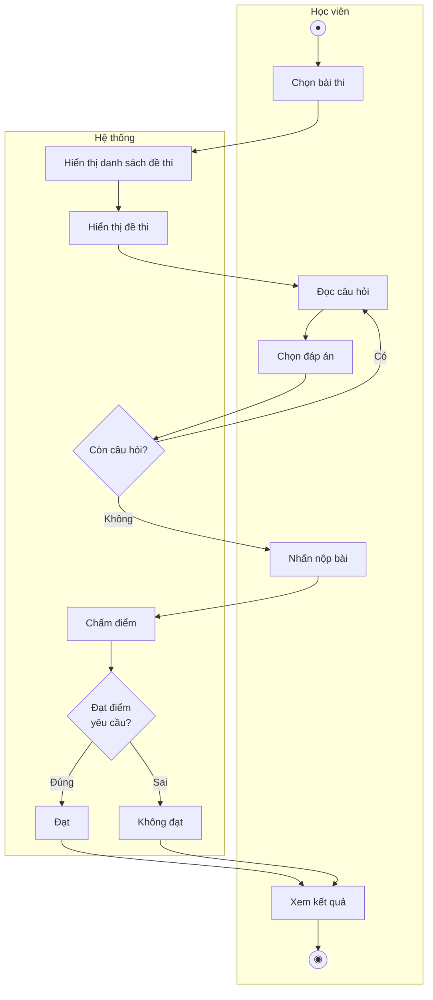
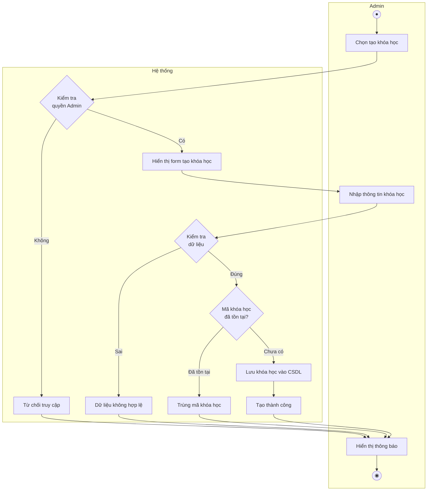

# Biểu Đồ Hoạt Động — Dự Án CCNA-Master

---

## 1. Đăng ký tài khoản

```mermaid
flowchart TD
    subgraph Người dùng
        S(("●"))
        A["Chọn đăng ký"]
        C["Nhập họ tên, email, mật khẩu"]
        K["Hiển thị thông báo"]
        E(("◉"))
    end

    subgraph Hệ thống
        B["Hiển thị form đăng ký"]
        D{"Kiểm tra\ndữ liệu"}
        F["Dữ liệu không hợp lệ"]
        G{"Kiểm tra\nemail trùng"}
        H["Email đã tồn tại"]
        I["Mã hóa mật khẩu"]
        J["Tạo tài khoản"]
        L["Đăng ký thành công"]
    end

    S --> A
    A --> B
    B --> C
    C --> D
    D -- "Sai" --> F
    F --> K
    D -- "Đúng" --> G
    G -- "Đã tồn tại" --> H
    H --> K
    G -- "Chưa có" --> I
    I --> J
    J --> L
    L --> K
    K --> E
```

---

## 2. Đăng nhập

```mermaid
flowchart TD
    subgraph Người dùng
        S(("●"))
        A["Chọn đăng nhập"]
        C["Nhập tài khoản, mật khẩu"]
        J["Hiển thị thông báo"]
        E(("◉"))
    end

    subgraph Hệ thống
        B["Hiển thị form đăng nhập"]
        D{"Kiểm tra\ndữ liệu"}
        F["Dữ liệu không hợp lệ"]
        G{"Kiểm tra\ntài khoản"}
        H["Đăng nhập thất bại"]
        I["Đăng nhập thành công"]
    end

    S --> A
    A --> B
    B --> C
    C --> D
    D -- "Sai" --> F
    F --> J
    D -- "Đúng" --> G
    G -- "Sai" --> H
    H --> J
    G -- "Đúng" --> I
    I --> J
    J --> E
```

---

## 3. Làm bài thi trắc nghiệm

```mermaid
flowchart TD
    subgraph Học viên
        S(("●"))
        A["Chọn bài thi"]
        D["Đọc câu hỏi"]
        F["Chọn đáp án"]
        H["Nhấn nộp bài"]
        M["Xem kết quả"]
        E(("◉"))
    end

    subgraph Hệ thống
        B["Hiển thị danh sách đề thi"]
        C["Hiển thị đề thi"]
        G{"Còn câu hỏi?"}
        I["Chấm điểm"]
        J{"Đạt điểm\nyêu cầu?"}
        K["Đạt"]
        L["Không đạt"]
    end

    S --> A
    A --> B
    B --> C
    C --> D
    D --> F
    F --> G
    G -- "Có" --> D
    G -- "Không" --> H
    H --> I
    I --> J
    J -- "Đúng" --> K
    J -- "Sai" --> L
    K --> M
    L --> M
    M --> E
```

---

## 4. Admin quản lý khóa học (Tạo mới)

```mermaid
flowchart TD
    subgraph Admin
        S(("●"))
        A["Chọn tạo khóa học"]
        C["Nhập thông tin khóa học"]
        J["Hiển thị thông báo"]
        E(("◉"))
    end

    subgraph Hệ thống
        B["Hiển thị form tạo khóa học"]
        D{"Kiểm tra\nquyền Admin"}
        E1["Từ chối truy cập"]
        F{"Kiểm tra\ndữ liệu"}
        G["Dữ liệu không hợp lệ"]
        H{"Mã khóa học\nđã tồn tại?"}
        H1["Trùng mã khóa học"]
        I["Lưu khóa học vào CSDL"]
        K["Tạo thành công"]
    end

    S --> A
    A --> D
    D -- "Không" --> E1
    E1 --> J
    D -- "Có" --> B
    B --> C
    C --> F
    F -- "Sai" --> G
    G --> J
    F -- "Đúng" --> H
    H -- "Đã tồn tại" --> H1
    H1 --> J
    H -- "Chưa có" --> I
    I --> K
    K --> J
    J --> E
```
