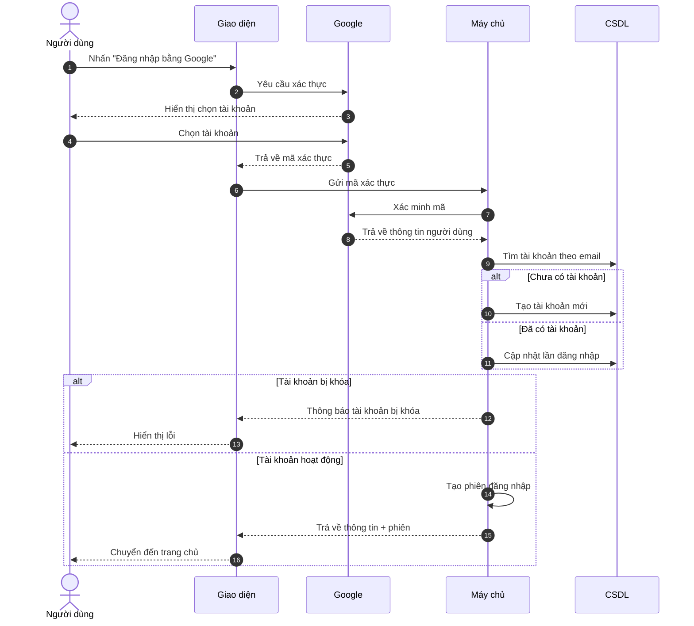
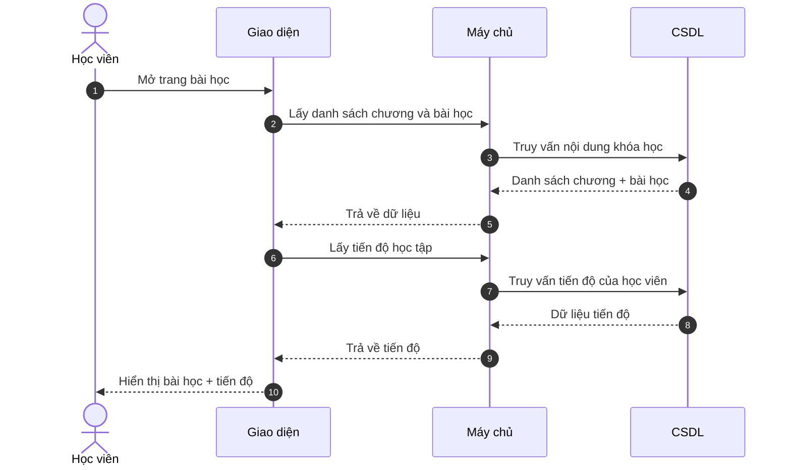
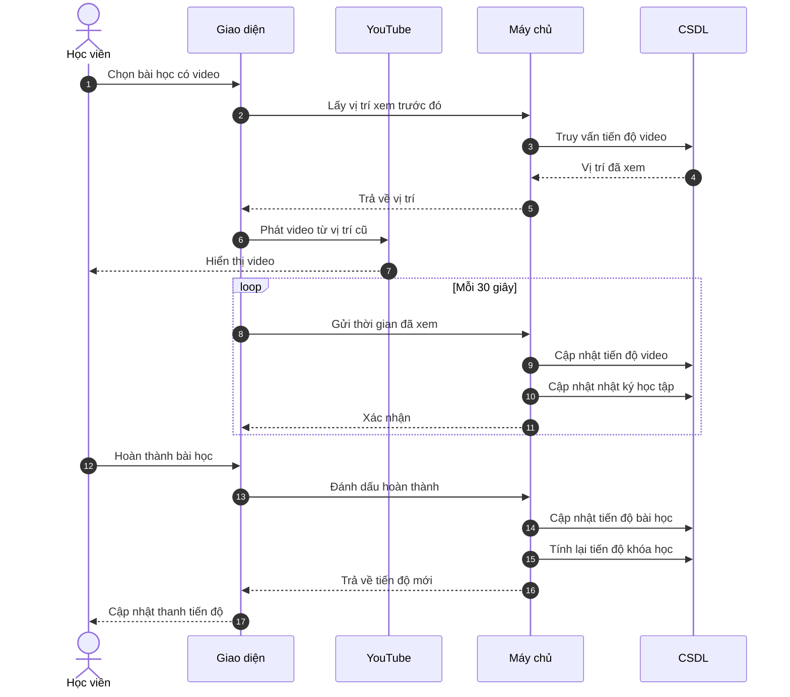
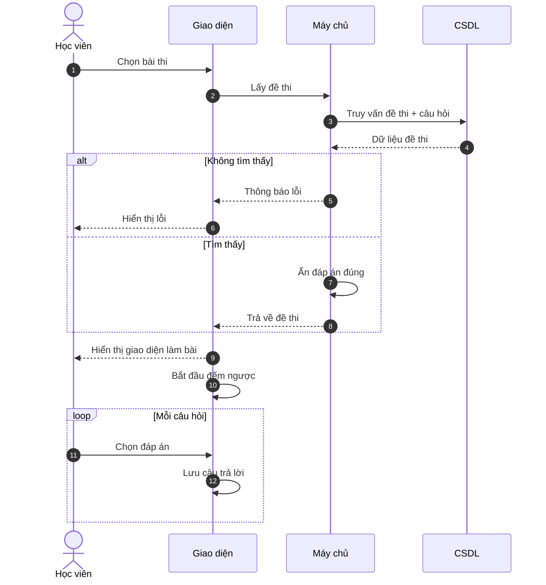
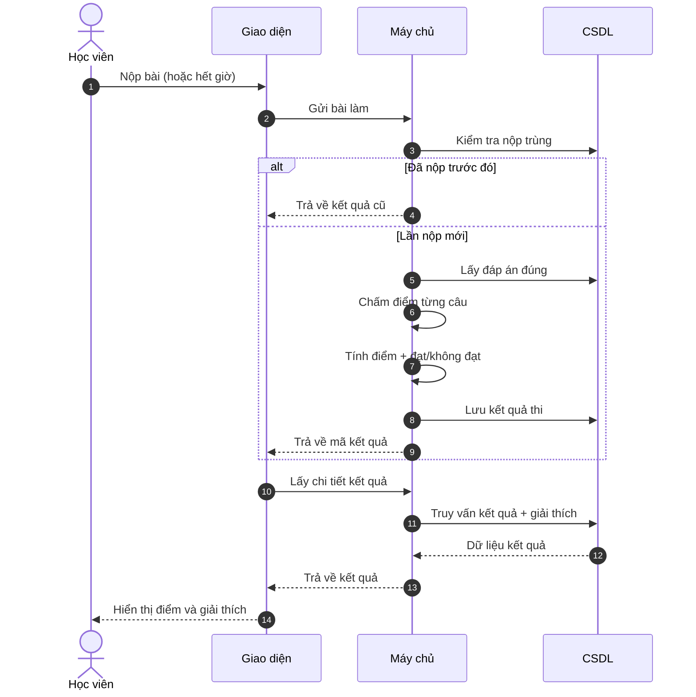
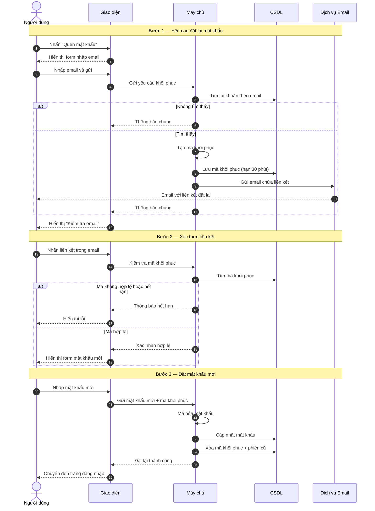
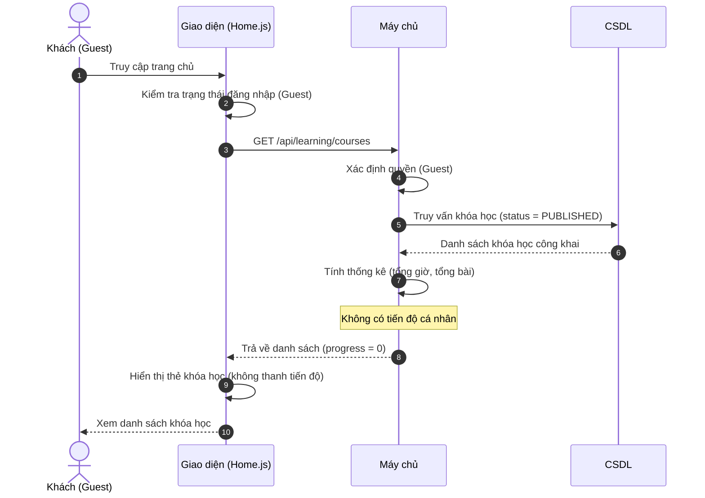
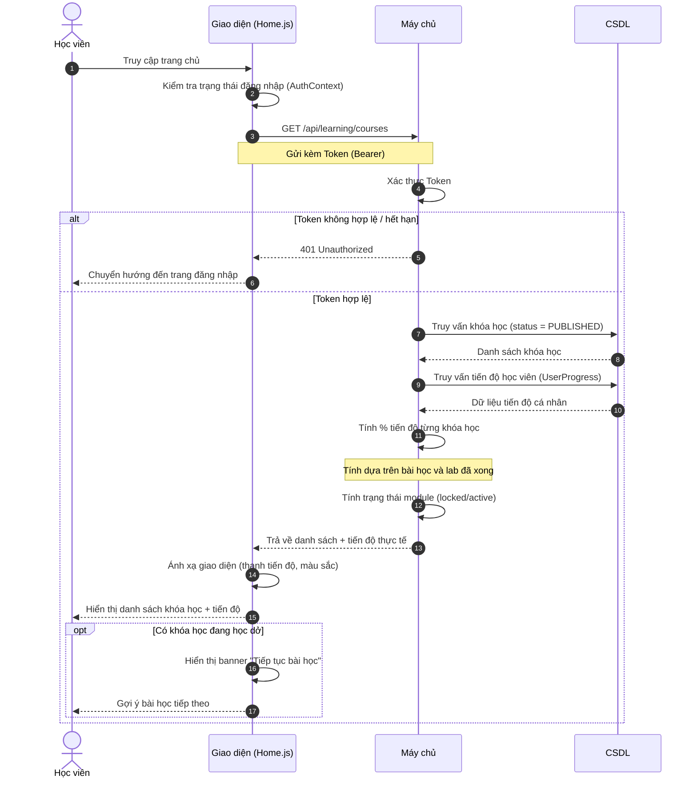
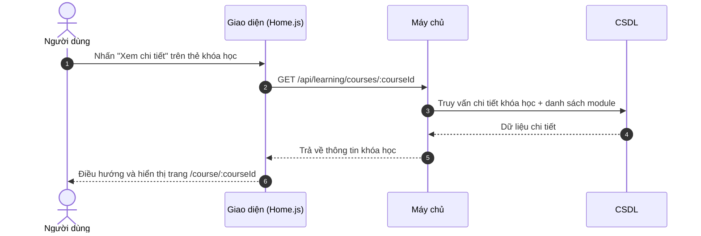

# Biểu Đồ Tuần Tự — Dự Án CCNA-Master

---

## 1. Đăng nhập bằng Google OAuth

---

## 2.1. Tải danh sách bài học và tiến độ

---

## 2.2. Theo dõi tiến độ video và hoàn thành bài học

---

## 3.1. Tải đề thi và làm bài

---

## 3.2. Nộp bài và xem kết quả

---

## 4. Quên mật khẩu & Đặt lại mật khẩu

---

## 5.1. Xem danh sách khóa học (Chưa đăng nhập)

---

## 5.2. Xem danh sách khóa học (Đã đăng nhập)

---

## 5.3. Điều hướng xem chi tiết khóa học

